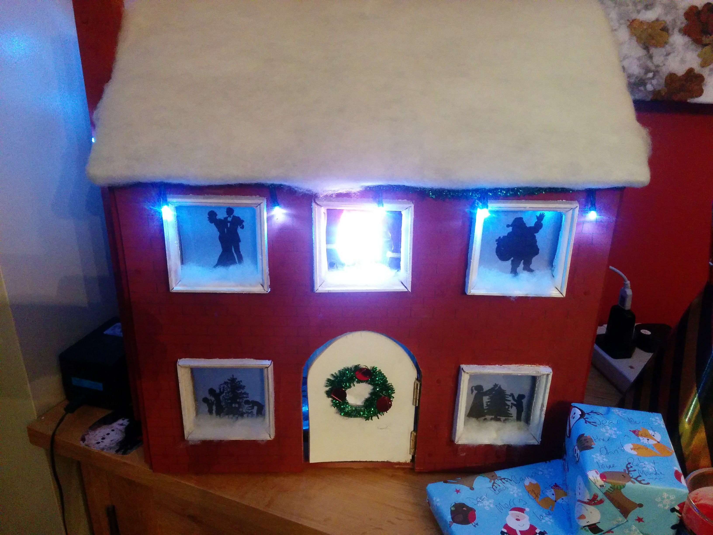

# xmas-house
There is a long running tradition in my family to give out a small selection of gifts from a small house on boxing day.

Normally my parents would make a house out of cardboard and cotton wool, sadly the damp finally got the old house and it was retired.

This year I decided to make a new house with the help of my kids and this is the result.

Throw in a raspberry pi, sense hat, speaker and little bit of python and this is what we have.

## video

[https://www.youtube.com/watch?v=3mrCXsvmZoo](https://www.youtube.com/watch?v=3mrCXsvmZoo)
